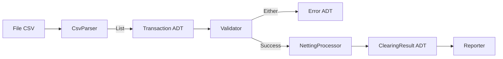

# Bilan Semaine 5
## Vers le Clearing Engine v1.0

**Durée :** ~2h | **Fil Rouge :** Une architecture mature et typée

---

# 📋 Objectifs du Jour

- Synthétiser les connaissances sur les ADTs.
- Mesurer l'impact de la modélisation sur la qualité du code.
- Effectuer une revue de code complète.
- Livrer la version 1.0 du prototype.

---

# 1. Rétrospective Modélisation

### Avant (Mois 1)
- Tuples anonymes `(String, String, BigDecimal)`.
- Risque de confusion entre les champs.
- Strings magiques pour les statuts.
- "Primitive Obsession".

### Après (Mois 2)
- **Case Classes** : Nommage explicite, documentation par le code.
- **Enums** : Statuts robustes et limités.
- **Sealed Traits** : Hiérarchies d'erreurs exhaustives.
- **Typage Fort** : Le compilateur guide le développeur.

---

# 🛡️ La Prophétie du Compilateur

"Si ça compile, il y a de fortes chances que ça marche."

En FP, on passe 70% du temps à concevoir les types (ADTs) et 30% à écrire la logique.
- Les types éliminent des classes entières de bugs.
- Le code devient résilient au changement.
- L'intention métier est au premier plan.

---

# 🏗️ Architecture du Clearing Engine v1.0

---

# 🚀 Vers la Semaine 6

La semaine prochaine, nous aborderons :
1. **La Gestion d'Erreurs Avancée** (`Either`, `Validated`).
2. **Le Pattern Monadique** (flatMap partout).
3. **Le Type Safe Errors** : Ne plus jamais lancer d'Exception.

---

# 🧠 Quiz de Fin de Semaine

1. Quelle structure utiliser pour une variable qui ne peut avoir que 4 valeurs précises ?
2. Quel est l'avantage de `case class` pour le test unitaire ?
3. Pourquoi a-t-on supprimé tous les Tuples du moteur de clearing ?

---

# 📝 Conclusion

Félicitations ! Tu as franchi une étape majeure. Ton code ne ressemble plus à un script d'étudiant, mais à une application professionnelle robuste et architecturée.

**Dernière étape** : Finaliser la v1.0 dans le TP 25 !
