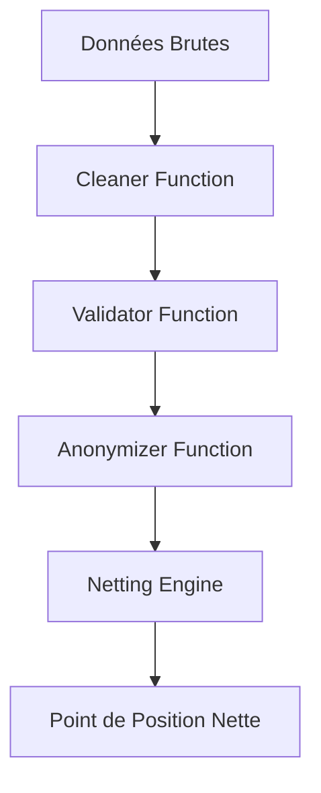

# Bilan Semaine 9
## La Révolution Fonctionnelle est en marche

**Durée :** ~2h | **Fil Rouge :** Clearing Engine v2.0 — Le Cœur Pur

---

# 📋 Objectifs du Jour

- Synthétiser les concepts de RT, Pureté et Composition.
- Imaginer l'architecture du futur moteur comme un pipeline de fonctions.
- Comprendre pourquoi ce changement radical améliore la maintenabilité.
- Livrer la version 2.0 (Logic-Only) du moteur.

---

# 1. Rétrospective Architecturale

### Version 1.3 (S8)
- Objets et Classes (Style Java-ish).
- Effets de bord éparpillés.
- Contexte Spring et I/O imbriqués.

### Version 2.0 (S9)
- **Functions-First** : La logique est un assemblage de briques.
- **Isolé** : Le calcul de netting est mathématiquement pur.
- **Configurable** : Injection de règles par currying.
- **Réutilisable** : Chaque brique peut être testée sans Spring ni DB.

---

# 🛡️ La Puissance du Cœur Pur

En séparant les **Calculs** (Fonctions Pures) des **Actions** (I/O), on obtient :
- Un moteur **indestructible** : les calculs ne peuvent pas échouer à cause du réseau.
- Un moteur **instantané** : pas besoin de mocker des services pour les tests.
- Un moteur **évolutif** : changer l'ordre du clearing, c'est juste changer l'ordre des fonctions dans `andThen`.

---

# 🏗️ Architecture du Clearing Engine v2.0



> 💡 Notez que chaque flèche est un `andThen`.

---

# 🚀 Vers la Semaine 10 — Les Réponses à tes Frustrations

Tu as noté deux gênes dans le code v2.0 :

| Frustration (S9) | Solution (S10) |
|---|---|
| Trimballer un Tuple `(succès, erreurs)` partout | `Either[ClearingError, Transaction]` → chaque élément **sait** s'il est un succès ou une erreur |
| Pas de court-circuit si une étape au milieu échoue | `flatMap` / for-comprehension → propagation **automatique** du `Left` |

### Railway Oriented Programming
```
    ───Right(tx)───→ validate ───Right(tx)───→ compute ───→ 🎯
         ↘                ↘                 ↘
          Left(err)────────Left(err)─────────Left(err)──→ 🗑️
```
> 💡 L'erreur "voyage" le long du rail gauche sans exécuter le code suivant.

---

# 🧠 Quiz de Fin de Semaine

1. Quel est l'opposé d'un Effet de Bord ? (La Pureté / RT).
2. "andThen" permet-il de composer deux fonctions dont les types ne correspondent pas ? (Non, les types doivent s'emboîter).
3. Pourquoi a-t-on supprimé les "println" du cœur de calcul ?

---

# 📝 Conclusion

Félicitations ! Tu as réussi la transition la plus difficile du stage : passer d'une vision "Impérative" à une vision "Fonctionnelle". Ton code est maintenant élégant, modulaire et professionnel.

**Dernière étape** : Finaliser la v2.0 dans le TP 45 !
