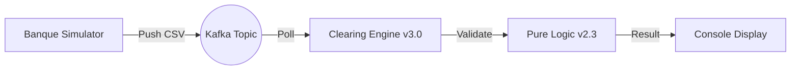

# Bilan Semaine 15
## Le Temps Réel au service du Clearing

**Durée :** ~2h | **Fil Rouge :** Clearing Engine v3.0 — Le Moteur Réactif

---

# 📋 Objectifs du Jour

- Synthétiser l'architecture de streaming Kafka.
- Analyser les bénéfices du dédoublonnage et du commit manuel.
- Visualiser le pipeline complet : Simulation -> Kafka -> Moteur v2.3 -> Display.
- Livrer la version 3.0 (Streaming) du moteur.

---

# 1. Rétrospective Architecturale

### Version 2.3 (Mois 3)
- Cœur métier pur, erreurs attendues typées.
- Mais s'exécutait sur une collection statique en mémoire (`List`).

### Version 3.0 (S15)
- **Connectée** : Lit ses données depuis un flux Kafka.
- **Réactive** : Traite chaque transaction en quelques millisecondes.
- **Scalable** : Prête à être déployée en plusieurs instances.
- **Garantie visée** : traitement at-least-once, détection des doublons pendant l'exécution et préparation d'une déduplication durable.

---

# 🛡️ La Puissance du Streaming

En passant à Kafka, ATH peut maintenant proposer un clearing "Intraday" :
- Les banques connaissent leur position nette en temps réel.
- Le risque systémique est réduit par une visibilité immédiate.
- On ne dépend plus de la livraison d'un fichier CSV par email à minuit.

---

# 🏗️ Architecture du Clearing Engine v3.0

---

# 🚀 Vers la Semaine 16

Dernière étape du mois 4 : La mémoire à long terme.
1. **Cassandra** : Pourquoi une base NoSQL pour stocker des milliards de transactions ?
2. **Modélisation par Query** : Oublie le SQL classique, pense à tes résultats d'abord.
3. **Persistance Asynchrone** : Enregistrer le résultat du clearing sans ralentir le flux Kafka.
4. **Démo Finale Mois 4** : Le système distribué complet.

---

# 🧠 Quiz de Fin de Semaine

1. Quelle est la différence entre un Offset et un ID de transaction ? (L'offset est technique Kafka, l'ID est métier).
2. Pourquoi subdiviser un topic en plusieurs partitions ? (Pour permettre à plusieurs consumers de travailler en même temps).
3. Quel est le risque de désactiver l'auto-commit ? (Si on oublie de commiter manuellement, on relira toujours les mêmes messages).

---

# 📝 Conclusion

Le moteur v3.0 démontre un pipeline Kafka local. Les limites de réplication, de déduplication et de persistance restent explicites avant toute extrapolation à la production.

**Dernière étape** : Utiliser le Kit 15.4 dans le TP du Jour 5.
