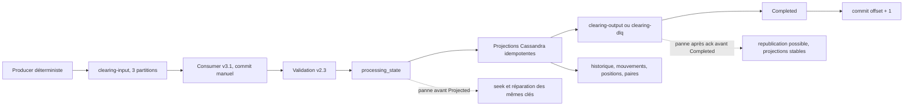

# Preuve S16 J5 — Qualification v3.1

Date d'exécution : 14 juillet 2026

Seed : `1600`

Volume : 500 records, dont 485 événements valides uniques, 5 JSON invalides
uniques et 10 replays exacts.

## Environnement propre

Le volume Cassandra et les données Kafka ont d'abord été supprimés, puis le
laboratoire Kafka 4.3.0 et Cassandra 4.1.11 a été recréé :

```bash
docker compose -f docker/docker-compose-v31.yml down -v --remove-orphans
docker compose -f docker/docker-compose-v31.yml up -d
docker compose -f docker/docker-compose-v31.yml wait kafka-init cassandra-init
sbt 'run qualify --seed 1600'
```

Le producer a confirmé tous ses envois :

```text
PRODUCER_V31 attempted=500 acknowledged=500 failed=0
```

## Coupure Cassandra pendant le traitement

Le consumer `marc-v31-midoutage` a été démarré sur les 500 records. Un script
de contrôle a interrogé `processing_state` et arrêté Cassandra dès la première
écriture partielle observée :

```text
MID_OUTAGE observed_processing_states=7
TimeoutException: seulement 9 records reçus sur 500 attendus
MID_OUTAGE consumer_exit=1 observed_processing_states=7
```

Après l'arrêt, Kafka exposait un seul offset committé :

```text
partition 0: current-offset=9, log-end-offset=290, lag=281
partitions 1 et 2: aucun offset encore committé
```

Le processus n'a donc pas transformé l'indisponibilité Cassandra en succès et
n'a pas sauté les 491 records restants. Après redémarrage de Cassandra, le même
groupe a repris exactement ce reste :

```bash
sbt 'run consumer --group-id marc-v31-midoutage --max-records 491'
```

```text
CONSUMER_V31 published=481 duplicates=10 failedPartitions=0
```

Le total des deux passages est 485 outputs, 5 DLQ et 10 replays absorbés. Les
offsets finaux du groupe sont 290, 101 et 109, avec un lag nul sur chaque
partition.

## Réconciliation Kafka et Cassandra

```text
clearing-input :  290 + 101 + 109 = 500
clearing-output:  283 +  97 + 105 = 485
clearing-dlq:       2 +   0 +   3 =   5

processing_state          = 490
clearing_history_by_day   = 485
transactions_by_bank_day  = 970
bank_positions            = 970
pair_activity_by_day      = 485
sum(bank_positions)       = 0.00
```

Les `count(*)` et la somme globale sont des scans réservés au gate local. Les
requêtes de production du repository restent bornées par leurs clés de
partition.

## Replay depuis un nouveau groupe

Un second groupe a relu les 500 entrées sans supprimer le volume Cassandra :

```bash
sbt 'run consumer --group-id marc-v31-replay --max-records 500'
```

```text
CONSUMER_V31 published=0 duplicates=500 failedPartitions=0
```

Son lag final est nul. Tous les offsets de sortie et tous les comptes Cassandra
ci-dessus sont restés inchangés. L'état durable absorbe donc aussi les replays
après redémarrage, contrairement au cache mémoire v3.0.

## Confidentialité

Les records Kafka complets ont été relus avec clé, headers et valeur. La table
d'historique Cassandra a également été inspectée avec le motif
`MA[A-Z0-9]{22}` :

```text
clearing-output full_record_raw_iban_matches=0
clearing-dlq full_record_raw_iban_matches=0
cassandra-history raw_iban_matches=0
```

## Limites de la preuve

Le laboratoire reste mono-broker et mono-nœud Cassandra, avec réplication 1.
Il ne démontre ni haute disponibilité, ni sécurité réseau, ni exactly-once
entre Kafka et Cassandra. Une panne après l'ack Kafka et avant `Completed` peut
encore dupliquer une sortie; les tests de crash vérifient que cette fenêtre ne
perd jamais la sortie et ne double pas les projections Cassandra.

## Observation opérationnelle de dix minutes

Un second environnement propre a reçu 30 000 événements déterministes valides
à 1 000 envois/s. Le consumer continu `marc-v31-stress` a ensuite été observé
pendant dix minutes. Chaque minute, le script a lu les offsets output/DLQ, le
lag du groupe, CPU/RSS du processus et `docker stats` de Kafka/Cassandra.

| Min | Classés | Débit fenêtre/s | Committés | Lag | App CPU | App RSS MiB | Kafka CPU | Kafka MiB | Cassandra CPU | Cassandra GiB |
|---:|---:|---:|---:|---:|---:|---:|---:|---:|---:|---:|
| 1 | 5 977 | 99.62 | 6 188 | 17 783 | 17.1 % | 966.5 | 18.98 % | 578.4 | 48.83 % | 2.812 |
| 2 | 13 436 | 124.32 | 13 660 | 16 340 | 13.4 % | 969.5 | 119.72 % | 876.5 | 42.34 % | 2.808 |
| 3 | 20 867 | 123.85 | 21 090 | 8 910 | 12.5 % | 970.1 | 5.02 % | 927.4 | 43.88 % | 2.850 |
| 4 | 28 494 | 127.12 | 28 717 | 1 283 | 13.5 % | 973.5 | 130.58 % | 1 017.0 | 37.10 % | 2.847 |
| 5 | 30 000 | 25.10 | 30 000 | 0 | 0.0 % | 973.4 | 103.57 % | 1 018.0 | 1.91 % | 2.860 |
| 6 | 30 000 | 0.00 | 30 000 | 0 | 0.0 % | 973.5 | 104.04 % | 1 019.0 | 2.78 % | 2.833 |
| 7 | 30 000 | 0.00 | 30 000 | 0 | 0.0 % | 508.4 | 2.23 % | 931.6 | 2.10 % | 2.832 |
| 8 | 30 000 | 0.00 | 30 000 | 0 | 0.5 % | 404.9 | 2.07 % | 930.4 | 1.85 % | 2.833 |
| 9 | 30 000 | 0.00 | 30 000 | 0 | 0.0 % | 414.1 | 1.96 % | 931.0 | 1.89 % | 2.835 |
| 10 | 30 000 | 0.00 | 30 000 | 0 | 0.1 % | 415.0 | 2.38 % | 931.8 | 1.73 % | 2.835 |

Ces commandes sont séquentielles, pas une transaction de monitoring. Le
compteur output est donc lu quelques secondes avant l'offset committé; la
première description du groupe était aussi encore partielle pendant
l'assignation. Les CPU Docker supérieurs à 100 % représentent plusieurs cœurs.
Le travail se termine pendant la cinquième fenêtre; les cinq suivantes
observent le système idle. La baisse RSS après la minute 6 est compatible avec
un GC, mais cette fenêtre ne prouve pas l'absence de fuite.

La réconciliation finale, après arrêt du consumer, est atomiquement stable à
l'échelle de chaque commande :

```text
input/output/committed = 30 000, DLQ = 0, lag = 0
processing_state = 30 000, history = 30 000, pairs = 30 000
movements = 60 000, positions = 60 000, global_position = 0.00
```

## Architecture présentée au mentor



Le chemin nominal montre la source d'entrée, les partitions et offsets, la
validation, l'état de reprise, les projections, la publication et le commit.
Le premier chemin d'échec répare une écriture partielle. Le second expose
honnêtement la seule fenêtre où une sortie peut être dupliquée.

## Compatibilité JVM

Les suites complètes S1–S16 ont été recréées après tous les ajouts :

```text
Java 21.0.6 : 551 tests, 95 suites, 0 échec, 1 live test désactivé
Java 17.0.4 : 551 tests, 95 suites, 0 échec, 1 live test désactivé
Cassandra live : 37 tests, 11 suites, 0 échec, 0 test désactivé
```

Le test live désactivé par défaut est exécuté séparément avec
`RUN_CASSANDRA_INTEGRATION=true`; il est inclus dans la troisième ligne.
